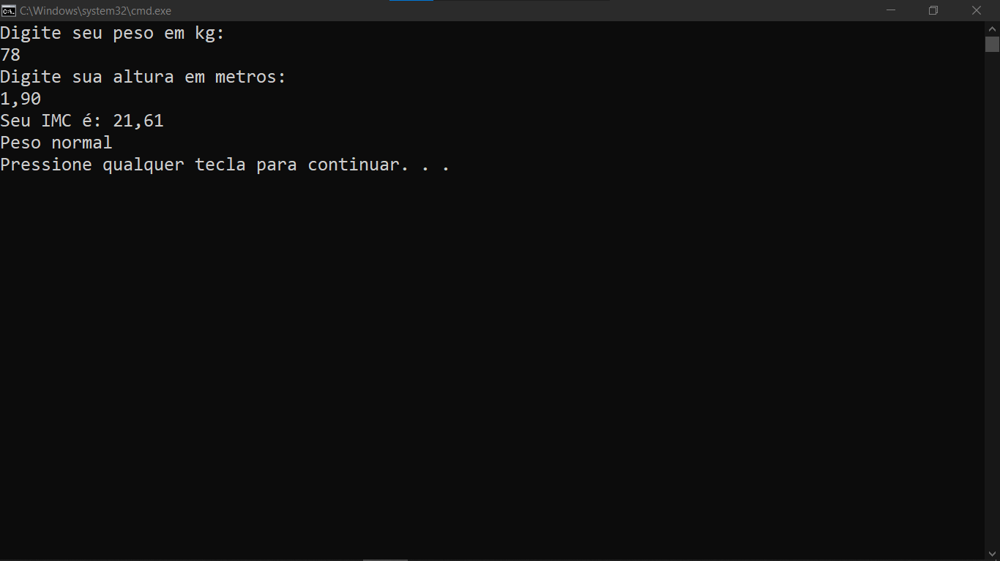

# CALCULO DE IMC
👨‍🏫CALCULO DE IMC NO CONSOLE DO VISUAL STUDIO.

  

## DESCRIÇÃO:
Este projeto é um aplicativo de console simples que calcula o Índice de Massa Corporal (IMC) de um usuário com base no peso e altura fornecidos. O IMC é uma medida usada para determinar se uma pessoa está em um peso saudável para sua altura.

## FUNCIONALIDADES:
1. **Solicita ao usuário o peso em quilogramas.**
2. **Solicita ao usuário a altura em metros.**
3. **Calcula o IMC usando a fórmula:**
   \[ \text{IMC} = \frac{\text{peso (kg)}}{\text{altura (m)}^2} \]
4. **Exibe o valor do IMC com duas casas decimais.**
5. **Classifica o IMC em categorias (Abaixo do peso, Peso normal, Sobrepeso, Obesidade) e exibe a classificação correspondente.**

## EXECUTANDO O PROJETO:
### ABRINDO NO VISUAL STUDIO:
- Abra o projeto `./CODIGO` no Visual Studio:
  1. Abra o Visual Studio.
  2. Clique em `File` > `Open` > `Project/Solution`.
  3. Navegue até o diretório `./CODIGO`.
  4. Selecione o arquivo da solução (`.sln`) do projeto e clique em `Open`.
  5. No Solution Explorer, abra o arquivo `Program.cs` para ver o código-fonte.

#### COMPILANDO E EXECUTANDO O PROJETO:
1. Pressione `Ctrl + Shift + B` para compilar o projeto.
2. Após a compilação, pressione `Ctrl + F5` para executar o projeto sem depuração.

### ABRINDO O EXECUTÁVEL:
- Abra o executável em `./CODIGO/IMC/bin/Debug/IMC.exe`:
  1. Abra o Explorador de Arquivos.
  2. Navegue até o diretório `./CODIGO/IMC/bin/Debug`.
  3. Dê um duplo clique no arquivo `IMC.exe` para executar o aplicativo.

### INTERAGINDO COM APP:
  - Quando solicitado, insira seu peso em quilogramas e pressione `Enter`.
  - Quando solicitado, insira sua altura em metros e pressione `Enter`.
  - O programa calculará e exibirá seu IMC, além de fornecer a classificação correspondente.

## NÃO SABE?
- Entendemos que para manipular arquivos nas linguagens relacionadas, é necessário possuir conhecimento nessas áreas. Para auxiliar nesse aprendizado, oferecemos cursos gratuitos disponíveis:
* [CURSO DE VISUAL STUDIO](https://github.com/VILHALVA/CURSO-DE-VISUAL-STUDIO)
* [CURSO DE C#](https://github.com/VILHALVA/CURSO-DE-C-SHARP)
* [CONFIRA MAIS CURSOS](https://github.com/VILHALVA?tab=repositories&q=+topic:CURSO)

## CREDITOS:
- [PROJETO CRIADO PELO VILHALVA](https://github.com/VILHALVA)

